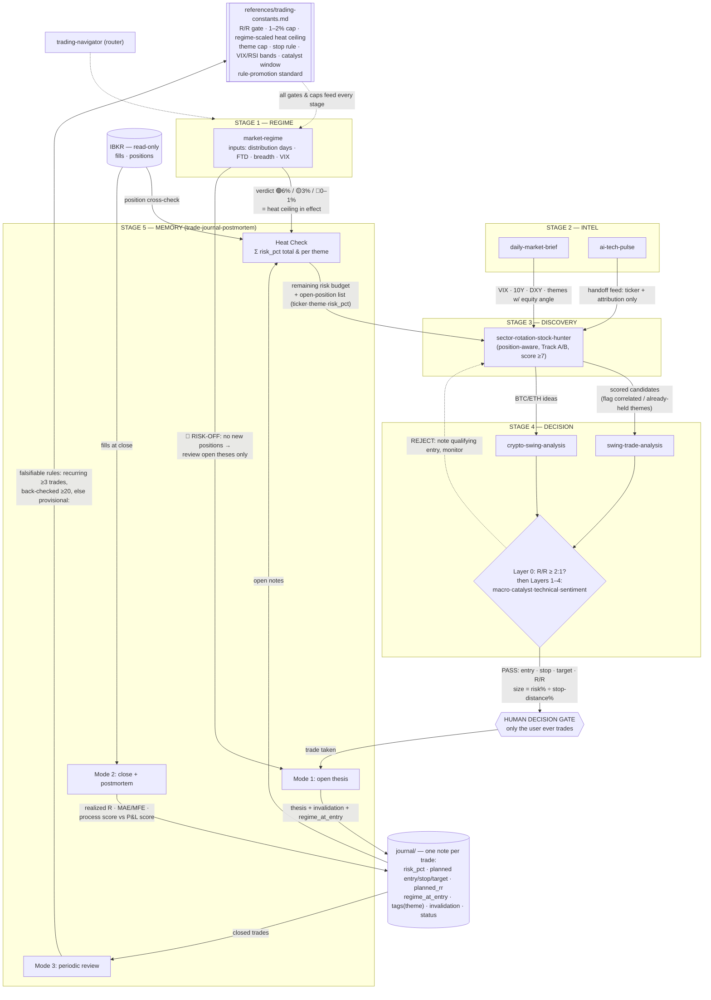

# Trading System

A personal trading-skill system, organized as **one source of truth**. The stateful core
(journal, postmortem, navigator, shared constants) lives here in Claude Code with local file +
broker access; the lightweight analysis skills are regenerated as `.skill` files for quick checks
in the Claude web app / mobile. Obsidian Sync is the bridge — your vault follows you across
devices, and Claude Code reads it at your desk.

> Research, analysis, and journaling assistant — **not** an automated trading system. It never
> places orders. It is not financial advice.

## Layout

```
trading-system/
├── CLAUDE.md                     project guidance for Claude Code
├── references/
│   ├── trading-constants.md      ← canonical: R/R gate, 1–2% cap, portfolio heat, VIX/RSI
│   └── news-sources.md           ← canonical: curated feeds for the digests
├── journal/                      trade notes for scheduled/cloud runs (the system's memory)
├── skills/
│   ├── market-regime/               REGIME: breadth/distribution/FTD → 🟢/🟡/🔴, sets heat ceiling
│   ├── daily-market-brief/          INTEL: macro/rates/Fed digest
│   ├── ai-tech-pulse/               INTEL: AI/tech news + handoff feed of ideas
│   ├── sector-rotation-stock-hunter/ DISCOVERY: position-aware candidate screen (Track A/B)
│   ├── swing-trade-analysis/        DECISION: Layer-0 gate + 4-layer checklist (stocks)
│   ├── crypto-swing-analysis/       DECISION: same framework, crypto-native layers (BTC/ETH)
│   ├── trade-journal-postmortem/    MEMORY: Heat Check + thesis/postmortem/review (Modes 1–3)
│   └── trading-navigator/           META: router + system map
├── workflows/
│   ├── pre-market-routine.md     regime → heat → brief → hunter → analysis → size → journal
│   ├── after-close-review.md     pull fills → postmortem each close
│   ├── weekly-review.md          aggregate → regime attribution → falsifiable rules
│   └── daily-automation.md       the self-running loop: 3 scheduled routines + journal/ state
└── scripts/
    └── build_dist.py             regenerate dist/*.skill from skills/ (constants inlined)
```

## Finish setup (3 local steps)

These are machine-specific, so they're left as placeholders for you to fill in Claude Code:

1. **Point at your Obsidian vault.** In `skills/trade-journal-postmortem/SKILL.md`, set
   `<OBSIDIAN_VAULT_PATH>` and `<JOURNAL_SUBFOLDER>`.
2. **Connect IBKR (read-only).** Wire fills/positions via IBKR MCP, a Flex query export, or the
   pasted-CSV fallback. The journal only ever *reads* the broker.
3. **Choose your data layer.** Stay on web_search (free, works anywhere) or add a paid API
   (FMP / Finviz / Alpaca) for precise data and screening. Everything runs either way.

## Install the skills in Claude Code

Copy each folder under `skills/` into your Claude Code skills directory (or keep this repo as your
project and let Claude Code discover them). Restart/reload so they register.

## Regenerate web-app / mobile copies

After any edit to a skill or to `references/trading-constants.md`:

```bash
python3 scripts/build_dist.py
```

This copies the shared references into each skill so the packaged version is self-contained, then
writes `dist/<skill>.skill`. Upload those in the web app under **Settings → Skills**. Never edit
the `dist/` files by hand — they're rebuilt from `skills/`.

## System map — all paths, stages, and variables



**The three daily paths** (scheduled — see `workflows/daily-automation.md`):

| Path | Route through the map | Stops when |
|---|---|---|
| **Pre-market** (12:30 UTC M–F) | REGIME → Heat Check → INTEL → DISCOVERY → DECISION → human gate | 🔴 regime, no heat budget, no leading sector, or Layer-0 REJECT |
| **After-close** (20:45 UTC M–F) | IBKR fills → Mode 2 postmortems → open-thesis invalidation checks | always runs to completion, commits `journal/` |
| **Weekly review** (Fri 21:30 UTC) | Mode 3 → regime attribution → falsifiable rules → constants (via promotion standard) | rule promotions proposed, never auto-applied |

**Key variables and where they live:**

| Variable | Set by | Read by | Canonical home |
|---|---|---|---|
| Regime verdict (🟢/🟡/🔴) | `market-regime` | Heat Check, both DECISION skills, hunter, journal | session (recorded per trade as `regime_at_entry`) |
| Heat ceiling in effect (6/3/0–1%) | regime verdict × heat table | Heat Check, sizing | `trading-constants.md` |
| Theme cap (½ ceiling) | constants | Heat Check, hunter | `trading-constants.md` |
| Open positions & `risk_pct` | Mode 1 (entry), Mode 2 (close) | Heat Check, hunter | `journal/` (cross-checked vs IBKR) |
| Per-trade risk cap (1–2%), R/R gate (≥2:1), stop rule (≤7–8%, structural), VIX/RSI bands, catalyst window (2–6w) | constants | every DECISION run | `trading-constants.md` |
| Realized R, MAE/MFE, process score | Mode 2 | Mode 3 | `journal/` |
| Operating rules | Mode 3 (via promotion standard) | every skill | `trading-constants.md` |

## Naming conventions (three vocabularies, kept apart)

- **Stage** — a tier of the system pipeline: REGIME → INTEL → DISCOVERY → DECISION → MEMORY.
- **Layer 0–4** — the checklist inside the decision skills. Layer 0 is the R/R gate (runs
  first); Layers 1–4 are always macro, catalyst, technical, sentiment — in both skills.
- **Heat Check / Modes 1–3** — the journal's functions: heat & exposure check, open thesis,
  close + postmortem, periodic review.

## Status

The system is feature-complete and runs on its own via three scheduled routines
(see `workflows/daily-automation.md`); scheduled runs journal to `journal/` in this repo.
Remaining machine-specific setup is the three local steps above. News sourcing is settled
as the shared `references/news-sources.md` (no dedicated skill needed).
